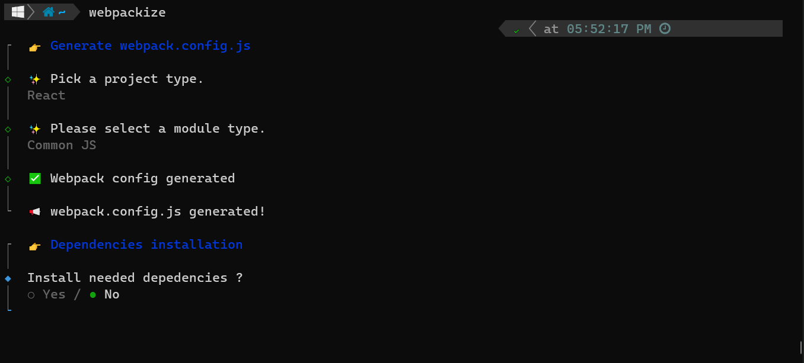

# Webpackize


A predefined configuration for webpack.config.js



## Usage

Change directory to your project

```bash
cd project_name
```

Recommended simple use case

```bash
# basic
npx webpackize

# directly specify the project type for the config (ex: react, vue, next , etc...)
npx webpackize --project <project-type>
```

Using global installation

```bash
npm install -g webpackize # npm
yarn add global webpackize # yarn

# you need just to call the package and it's done
webpackize

# directly specify the project type for the config (ex: react, vue, next , etc...)
webpackize --project <project-type>
```

## Framework and Library supported

Project Type available for CLI:

- [React](https://react.dev/)
- [Vue](https://vuejs.org/)
- [Next](https://nextjs.org/)
- [Nuxt](https://nuxtjs.org/)

## Support

Webpackize is an MIT-licensed open source project. It can grow thanks to the sponsors and support by the amazing backers.

## License

Webpackize is [MIT licensed](LICENSE).
